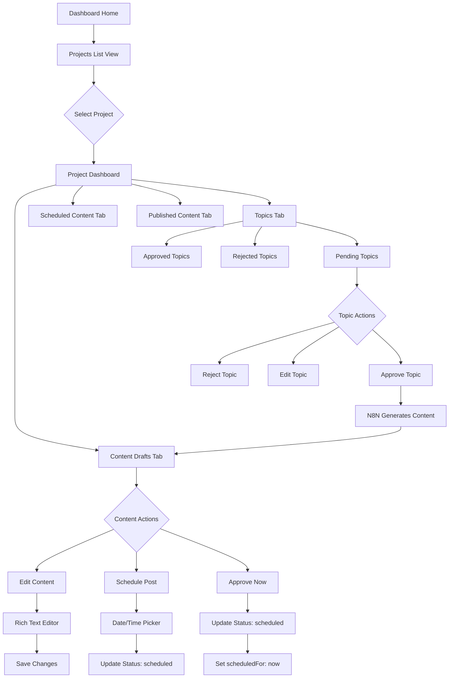
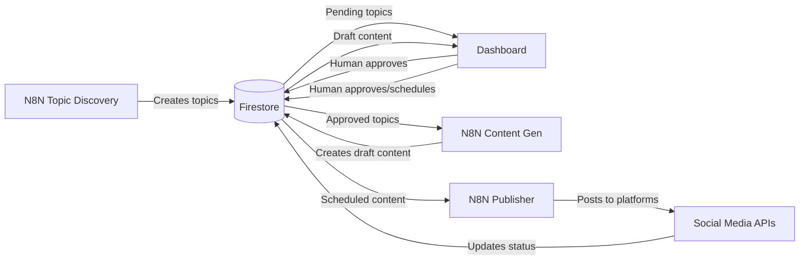

# Content Management Dashboard - Architecture Design

## Overview
A multi-project content management system where N8N workflows generate social media content that can be reviewed, edited, and scheduled through an Angular dashboard.

## Data Architecture

### Firestore Collections Structure (Using Subcollections)

```
firestore-root/
├── projects/
│   ├── {projectId}/
│   │   ├── name: string
│   │   ├── url: string
│   │   ├── logo: string (URL)
│   │   ├── platforms: string[] // ['x', 'facebook', 'reddit', etc.]
│   │   ├── createdAt: timestamp
│   │   │
│   │   ├── topics/ (subcollection)
│   │   │   ├── {topicId}/
│   │   │   │   ├── title: string
│   │   │   │   ├── description: string
│   │   │   │   ├── source: string // 'google_trends', 'reddit', 'manual', etc.
│   │   │   │   ├── sourceUrl: string (optional) // Link to trend/discussion
│   │   │   │   ├── keywords: string[] // SEO keywords
│   │   │   │   ├── targetPlatforms: string[] // Which platforms to create content for
│   │   │   │   ├── priority: string // 'high', 'medium', 'low'
│   │   │   │   ├── status: string // 'pending', 'approved', 'rejected', 'processed'
│   │   │   │   ├── notes: string // Human notes/instructions
│   │   │   │   ├── createdAt: timestamp
│   │   │   │   └── processedAt: timestamp (when content was generated)
│   │   │
│   │   └── content/ (subcollection)
│   │       ├── {contentId}/
│   │       │   ├── topicId: string // Reference to parent topic
│   │       │   ├── platform: string // 'x', 'facebook', 'reddit', etc.
│   │       │   ├── status: string // 'draft', 'scheduled', 'published'
│   │       │   ├── content: string // Rich text content
│   │       │   ├── media: Media[] // Array of media objects
│   │       │   ├── scheduledFor: timestamp (optional)
│   │       │   ├── publishedAt: timestamp (optional)
│   │       │   ├── createdAt: timestamp
│   │       │   └── updatedAt: timestamp
```

### Why Subcollections Are Better For This Use Case

1. **Simplified Querying**: Get all content for a project with a single collection reference
2. **Better Organization**: Content is naturally grouped under its parent project
3. **Easier Security Rules**: Can set rules based on parent document properties
4. **No Index Management**: Querying within subcollections doesn't require composite indexes
5. **Future Flexibility**: Can use Collection Group Queries if you need cross-project content views

### Media Object Schema
```typescript
interface Media {
  type: 'image' | 'video';
  url: string;
  thumbnail?: string;
  caption?: string;
  order: number;
}
```

## Application Flow



## Content Generation Workflow

```mermaid
flowchart LR
    A[N8N Discovers Topics] -->|Creates| B[Topic Document]
    B -->|Status: pending| C[Human Reviews]
    C -->|Approves| D[Status: approved]
    D -->|Triggers| E[N8N Content Generation]
    E -->|Creates| F[Content Documents]
    F -->|Platform-specific| G[X, FB, Reddit, etc.]
    G -->|Status: draft| H[Human Review/Edit]
    H -->|Approves| I[Schedule/Publish]
```



## Platform-Specific Requirements

| Platform | Max Text | Media Support | Special Features |
|----------|----------|---------------|------------------|
| X (Twitter) | 280 chars | 4 images OR 1 video | Thread support |
| Facebook | 63,206 chars | Multiple images/videos | Link preview |
| Instagram | 2,200 chars | 10 images OR 1 video | Carousel, Stories |
| LinkedIn | 3,000 chars | Multiple images | Article format |
| Reddit | 40,000 chars | 1 image OR 1 video | Subreddit targeting |
| TikTok | 2,200 chars | 1 video required | Sound selection |
| Blog | Unlimited | Unlimited | SEO metadata |

## View Components

### 1. Projects List View
- Grid/List toggle
- Project cards showing:
  - Logo
  - Name
  - URL
  - Active platforms icons
  - Content count by status

### 2. Project Dashboard View (Updated)
- **Topics Section**
  - Status filter tabs (Pending, Approved, Rejected)
  - Topic cards showing:
    - Title and description
    - Source (Google Trends icon, Reddit icon, etc.)
    - Target platforms
    - Priority badge
    - Quick actions (Approve, Reject, Edit)
  - Bulk approve/reject functionality
  
- **Content Section**
  - Platform filter dropdown
  - Status tabs (Draft, Scheduled, Published)
  - Content cards showing:
    - Platform icon
    - Content preview (truncated)
    - Media thumbnails
    - Status badge
    - Linked topic (if applicable)
    - Scheduled time (if applicable)
    - Quick actions (Edit, Schedule, Approve)

### 3. Topic Management Modal
- Form fields:
  - Title (required)
  - Description/brief
  - Target platforms (multi-select)
  - Priority level
  - Keywords/tags
  - Special instructions for AI
- Source information (read-only if from N8N)
- Approve/Reject/Save buttons

### 4. Content Editor Modal
- Rich text editor (QuillJS recommended)
- Media upload/management
- Platform-specific character counter
- Topic reference (if content was generated from topic)
- Preview pane
- Save/Cancel actions

## N8N Integration Points



## Status Workflows

### Topic Status Flow:
1. **Pending** - Discovered by N8N, awaiting human review
2. **Approved** - Human approved, triggers content generation
3. **Rejected** - Human rejected, no action taken
4. **Processed** - Content has been generated from this topic

### Content Status Flow:
1. **Draft** - Generated from approved topic, awaiting review
2. **Scheduled** - Approved with publish date/time
3. **Published** - Successfully posted to platform

## Key Features

1. **Multi-project Support** - Single dashboard for all projects
2. **Platform-aware Editing** - Validation based on platform limits
3. **Rich Media Support** - Upload and manage images/videos
4. **Bulk Actions** - Select multiple items to approve/schedule
5. **Real-time Updates** - Firestore listeners for live status changes
6. **Responsive Design** - Mobile-friendly for on-the-go management
7. **Collection Group Queries** - Option to view all content across projects (future feature)

## Technical Considerations

- Use Angular Material for consistent UI
- Implement lazy loading for project content
- Add pagination for large content lists
- Use Firebase Storage for media files
- Implement proper error handling for API limits
- Add search/filter functionality within projects

## Security Rules (Updated for Subcollections)
```javascript
// Projects can be read/written by authenticated users
match /projects/{projectId} {
  allow read, write: if request.auth != null;
  
  // Content inherits permissions from parent project
  match /content/{contentId} {
    allow read, write: if request.auth != null;
  }
}
```

This design keeps the architecture simple while providing all necessary functionality for content management across multiple projects and platforms.